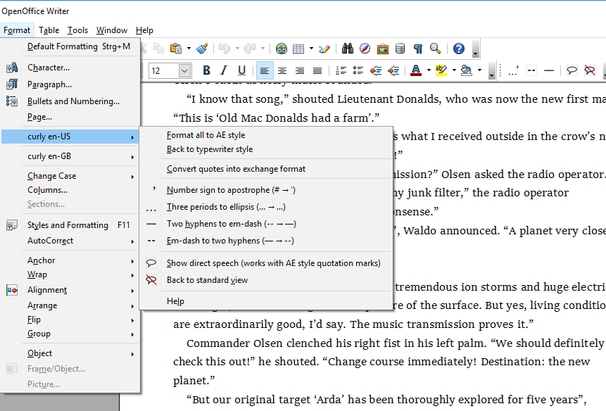

When post-editing existing text, Writer's auto-formatting feature can convert the typewriter keyboard's "straight" quotes and apostrophes into typographic "curly" ones. However, this works only for paragraphs assigned the "default" paragraph style and, depending on the document language, for the quotation marks once set. 
 
The "curly quotes" extensions convert quotes, apostrophes, dashes and ellipses between different language-dependent styles, whatever the document or system language. You can also convert the typographic glyphs back to the "typewriter" style if desired. This works regardless of the paragraph style you set.

You can install several language variants in parallel. Use the exchange format to convert quotation marks between different languages.

## Features

* _Smart quotes_ macros.

* _Find and replace_ macros for apostrophes and dashes.

* Revert to keyboard characters.

* Extensions are available for 
 en-US, 
 [en-GB](https://peter88213.github.io/curly-en-GB), 
 [de-DE](https://peter88213.github.io/curly-de-DE), 
 [de-CH](https://peter88213.github.io/curly-de-CH), 
 [fr-FR](https://peter88213.github.io/curly-fr-FR).

* Convert from one language to another via exchange format.

* Menu and toolbar with buttons.

* Dialog view to identify direct speech.

## System requirements

* __OpenOffice.org 3.x or Apache OpenOffice 4.x or LibreOffice 6.x__
* __Java__ (OpenOffice needs it for macro execution)

## Download and install

Download the variant that matches your Office installation:

[LibreOffice 6.x variant (curly_en-US-L-3.2.1.oxt)](https://raw.githubusercontent.com/peter88213/curly-en-US/master/curly_en-US-L-3.2.1.oxt)

[Apache OpenOffice 4.x variant (curly_en-US-A-3.2.1.oxt)](https://raw.githubusercontent.com/peter88213/curly-en-US/master/curly_en-US-A-3.2.1.oxt)

[OpenOffice.org 3.x variant (curly_en-US-3.2.1.oxt)](https://raw.githubusercontent.com/peter88213/curly-en-US/master/curly_en-US-3.2.1.oxt)

* Installation right at download, by double-clicking on the downloaded file, or via the OpenOffice/LibreOffice Extension Manager.

* After installation (and Office restart) you find a new submenu for each language version in the *Format* menu.

* Optionally, you can dock a toolbar for your convenience. If you don't need the toolbar (e.g. because it's not your first language), just close it.

* If no additional submenu shows up in the *Format* menu, please look in the *Tools > Extensions* menu.

[Changelog](changelog)

## Usage

See the [instructions for use](usage)

## Credits

[OpenOffice Extension Compiler](https://wiki.openoffice.org/wiki/Extensions_Packager#Extension_Compiler) by Bernard Marcelly.

## License

This extension is distributed under the [MIT License](http://www.opensource.org/licenses/mit-license.php).